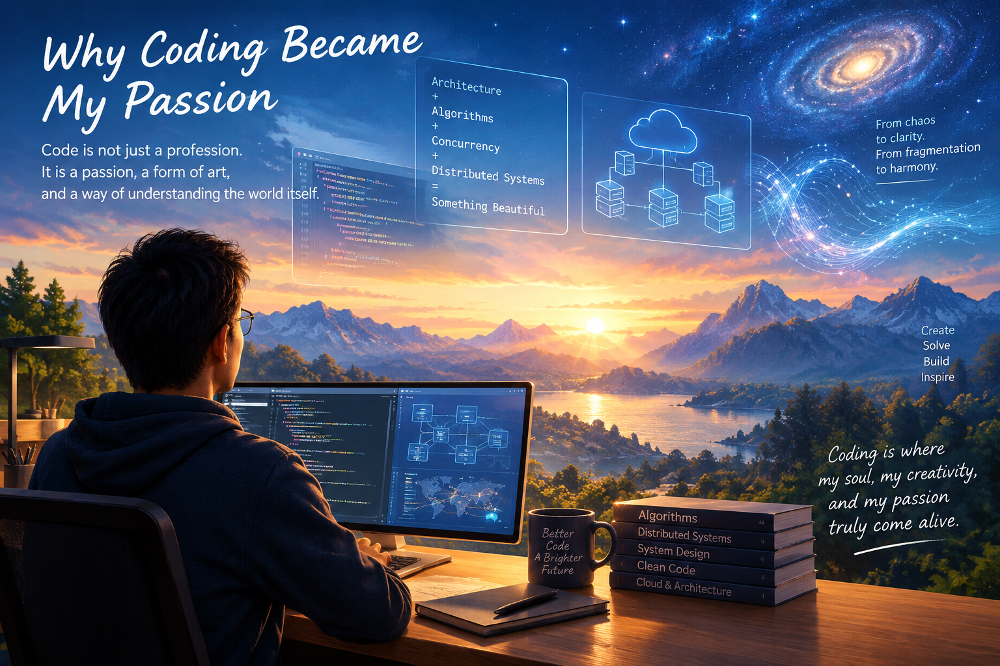

# Why Coding Became My Passion

Coding is far more than a profession to me — it is a passion, a form of art, and a way of understanding the world itself.

To many people, code may appear to be nothing more than cold symbols and rigid logic.  
But to me, truly beautiful coding carries rhythm, harmony, and soul.  
It feels like standing before a magnificent landscape painting where every line, every structure, and every connection exists with purpose and elegance.

When architecture, algorithms, concurrency, and distributed systems intertwine seamlessly, they create something profoundly beautiful — a hidden order emerging from complexity, like stars aligning across a vast universe.  
There is a quiet poetry in transforming chaos into clarity, fragmentation into harmony, and abstract ideas into living systems that can touch millions of lives.

Coding is not merely about solving technical problems.  
It is an act of creation.  
It is the pursuit of simplicity beyond complexity, the search for order within chaos, and the human desire to turn imagination into reality.

Every elegant design, every resilient distributed system, every breakthrough born from deep thinking carries a kind of emotional resonance that words alone can hardly describe.  
Those moments do not simply bring satisfaction — they inspire awe, wonder, and a deep sense of meaning.

And that is why I love coding.  
It is the source of inspiration behind my creativity, the driving force of my imagination, and the very place where my soul, my creativity, and my passion truly come alive.
